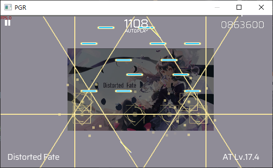

# RTL
> [中文](./README.md)
### Introduction
`PhigrosRenderer` is a Phigros renderer written in `C++` for the `Windows` platform

Drawing inspiration from the software architecture of [`papFri`](https://www.bilibili.com/video/BV1YJ7uzGE9x), it implements the following basic rendering features:

 - Reads and renders official Phigros charts
 - Resizable window with movement and zoom controls via mouse, WASD keys, and scroll wheel
 - Information display showing song title, difficulty, etc.
 - Press C to display additional information, V to restore
 - Press F or R to highlight the line, pressing again increases (F) or decreases (R) the highlighted line number
 - Select and read song information files

### Usage

##### Operating Environment

```
CPU: Intel E5-2673 v3
Operating System: Windows 10
Compiler: MSVC 2019
```

#### Download `Release` Version
Click `Release` to download the latest version of the `PGR` compressed package and extract it.
Enter the `build` directory, then navigate to either `x64-Release` or `x86-Release` to find `PGR.exe`

#### Build from Source

```
git clone https://github.com/phigrostl/PhigrosRenderer.git  // Clone the repository
cd PhigrosRenderer                                          // Enter the project directory
mkdir build                                                 // Create build directory
cd build                                                    // Enter build directory
cmake .. --DCMAKE_BUILD_TYPE=Release                        // Configure the project
cmake --build . --config Release                            // Build the project
cd x86 or x64-Release                                       // Enter Release directory
.\PGR.exe                                                   // Run PGR
```

#### Edit Code with `VS2019`
```
git clone https://github.com/phigrostl/PhigrosRenderer.git  // Clone the repository
cd PhigrosRenderer                                          // Enter the project directory
mkdir build                                                 // Create build directory
cd build                                                    // Enter build directory
.\PGR.sln                                                   // Open VS2019 project
```

### Effects
 - `Distorted Fate` | Music: `Sakuzyo` | Draw: `knife美工刀` | Chart: `unDefined Future` (`JKy`, `NerSAN`, `Rikko`, `TangScend`, `百九十八`, `晨`)

https://github.com/user-attachments/assets/33d83e33-ef11-49ea-94ca-2bcd5c1508a3
 > GitHub only allows 10MB file uploads, this is compressed

 <div>
	
 </div>
 
 <div>
	
 </div>

 <div>
	
 </div>