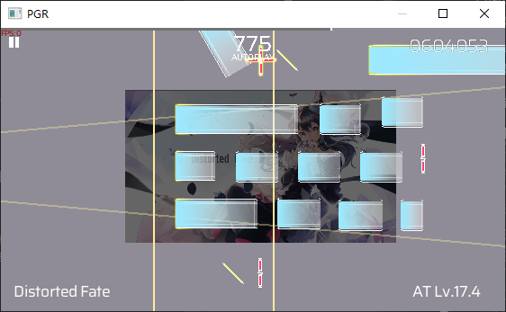
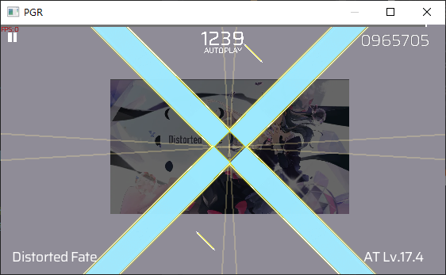

# RTL
> [English](./README-en.md)
### 介绍
`PhigrosRenderer` 是一个在 `Windows` 平台使用 `C++` 编写的Phigros渲染器

借鉴了 [`papFri`](https://www.bilibili.com/video/BV1YJ7uzGE9x) 的软件架构，实现了基本的渲染功能：

 - 实现了Phigros官谱的读取与渲染
 - 窗口可拉伸，可用鼠标、WASD键与滚轮进行移动与缩放
 - 增加信息显示，能渲染歌曲的曲名难度等
 - 按下C键可显示更多信息，V键恢复
 - 按下F键或R键可加重显示该线，再次点击则增加（F）或减少（R）加重显示的线号
 - 选择歌曲信息文件并读取

### 使用方法

##### 运行环境

```
CPU : Intel E5-2673 v3
操作系统 : Windows 10
编译器 : MSVC 2019
```

#### 下载 `Release` 版本
点击 `Release` 下载最新版本的 `PGR` 压缩包并解压
进入 `build` 目录，在 `x64-Release` 或 `x86-Release` 目录下即可找到 `PGR.exe`

#### 自行构建

```
git clone https://github.com/phigrostl/PhigrosRenderer.git  // 克隆项目
cd PhigrosRenderer                                          // 进入项目目录
mkdir build                                                 // 创建构建目录
cd build                                                    // 进入构建目录
cmake .. --DCMAKE_BUILD_TYPE=Release                        // 配置项目
cmake --build . --config Release                            // 构建项目
cd x86 or x64-Release                                       // 进入Release目录
.\PGR.exe                                                   // 运行PGR
```

#### 使用 `VS2019` 编辑代码
```
git clone https://github.com/phigrostl/PhigrosRenderer.git  // 克隆项目
cd PhigrosRenderer                                          // 进入项目目录
mkdir build                                                 // 创建构建目录
cd build                                                    // 进入构建目录
.\PGR.sln                                                   // 打开VS2019项目
```

### 效果
 - `Distorted Fate` | Music : `Sakuzyo` | Draw : `knife美工刀` | Chart : `unDefined Future` (`JKy`、`NerSAN`、`Rikko`、`TangScend`、`百九
十八`、`晨`)


https://github.com/user-attachments/assets/33d83e33-ef11-49ea-94ca-2bcd5c1508a3
 > Github只能上传10MB文件，这是被压缩后的

 <div>
	
 </div>
 
 <div>
	
 </div>

 <div>
	
 </div>
